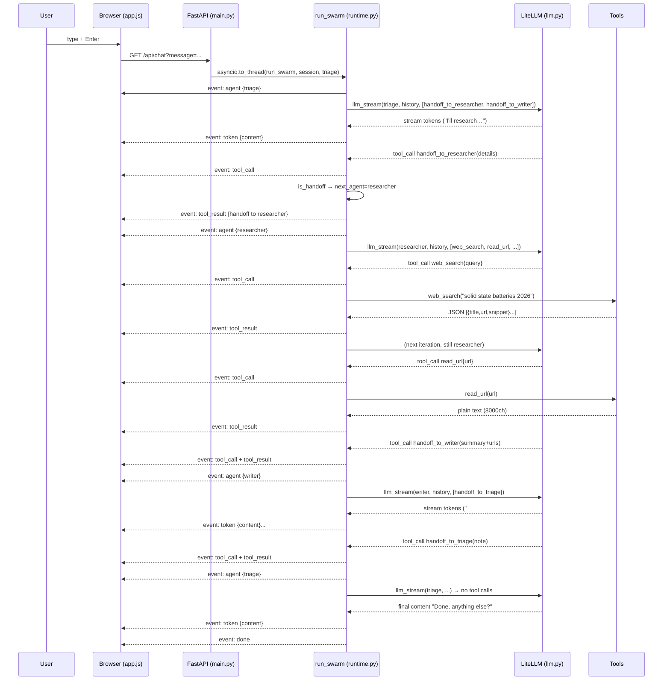

# Swarm Agent — Architecture

> Companion to `README.md` (run instructions) and `design.md` (UI tokens & layout).
> Code is vanilla Python + FastAPI + LiteLLM; frontend is zero-build vanilla JS.

---

## 1) Overview

Swarm Agent is a minimal OpenAI Swarm-style runtime: **one request → many agents → one SSE stream**. There is no orchestrator framework — the loop in `app/core/runtime.py:43` is ~70 lines. Agents are dataclasses; tools are plain functions; handoffs are plain dicts.

**Capabilities:** triage incoming user intent → research the web (`web_search`, `read_url`) → synthesize a cited report — all streamed live to a two-pane UI that makes the backend process diagrammatically visible.

**Non-goals:** persistent sessions, parallel fan-out, auth, RBAC, DB. Sessions are in-memory with a 3600s TTL (`app/sessions.py:13`).

---

## 2) High-Level Map

```
Browser (static/index.html + app.js)                FastAPI (app/main.py)                    Runtime (app/core/runtime.py)
┌───────────────────────────────┐                    ┌──────────────────────┐                  ┌──────────────────────────┐
│  Pane: Process rail (SVG)      │  EventSource      │  GET /api/chat?msg   │  on_event()     │  run_swarm()             │
│  Pane: Conversation (bubbles)  │◀──── SSE ─────────│  _sse_stream()       │◀── queue ──────│  llm_stream()            │
│  Composer textarea + Send     │  GET /api/agents  │  GET /  (static)     │                 │  web_search / read_url   │
└───────────────────────────────┘                    └──────────────────────┘                  └──────────────────────────┘
         │                                                    │                                       │
         │  session_id (hex12)                                │  get_session() / touch()              │  Agent.instructions
         └────────────────────────────────────────────────────┴── sessions.py ────────────────────────┴── agents/*.py
```

**Repo map**

```
Swarm Agent/
├── app/
│   ├── main.py              # FastAPI app, routes, SSE bridge           — app/main.py:27
│   ├── sessions.py          # Session {id, messages[], last_active}     — app/sessions.py:13
│   ├── core/
│   │   ├── agent.py         # Agent dataclass, schema, handoff helpers  — app/core/agent.py:22
│   │   ├── runtime.py       # run_swarm loop + event emission            — app/core/runtime.py:43
│   │   └── llm.py           # LiteLLM streaming wrapper                  — app/core/llm.py:34
│   ├── agents/
│   │   ├── __init__.py      # REGISTRY: triage/researcher/writer         — app/agents/__init__.py:10
│   │   ├── triage.py        # Planner, routes to researcher/writer       — app/agents/triage.py:44
│   │   ├── researcher.py    # web_search + read_url → handoff to writer  — app/agents/researcher.py:33
│   │   └── writer.py        # synthesizes report → handoff to triage     — app/agents/writer.py:24
│   └── tools/
│       ├── web_search.py    # Tavily or DuckDuckGo scrape                — app/tools/web_search.py:19
│       └── read_url.py      # fetch + strip HTML → text                  — app/tools/read_url.py:12
├── static/
│   ├── index.html           # two-pane shell (header + rail + chat)      — static/index.html:1
│   ├── style.css            # warm-graphite tokens, rail, lanes          — static/style.css:1
│   └── app.js               # EventSource → rail+chat renderer           — static/app.js:1
├── run.py                   # uvicorn entry (HOST/PORT from env)         — run.py:6
├── requirements.txt         # fastapi, uvicorn, litellm, httpx, bs4      — requirements.txt:1
├── .env.example             # LLM_MODEL, API keys, PORT                  — .env.example:1
├── design.md                # design system, colour plan, diagram spec
└── ARCHITECTURE.md          # this file
```

---

## 3) Components

### 3.1 FastAPI Server — `app/main.py:27`

```python
app = FastAPI(title="Swarm Agent", version="0.1.0")          # app/main.py:27
app.mount("/static", StaticFiles(directory=STATIC_DIR))       # app/main.py:28
@app.get("/")           -> FileResponse(static/index.html)    # app/main.py:31
@app.get("/api/agents") -> {agents:[{name, description}]}     # app/main.py:36
@app.get("/api/chat")   -> StreamingResponse(text/event-stream)# app/main.py:46
```

- `GET /api/chat` is intentionally `GET` (not `POST`) so the browser can use the native `EventSource` API without a fetch polyfill (`app/main.py:5` docstring).
- Query params: `message` (required, non-empty), `session_id` (optional, hex12), `agent` (optional, overrides start agent).
- The handler appends the user message to `session.messages` *before* streaming (`app/main.py:57`) so the history is durable even if the client disconnects mid-stream.
- `_sse_stream()` (`app/main.py:70`) bridges the **sync** `run_swarm` (run in a worker thread) to the **async** response via an `asyncio.Queue` + `loop.call_soon_threadsafe`. It emits `Cache-Control: no-cache` / `X-Accel-Buffering: no` so proxies don’t buffer the stream.

### 3.2 Sessions — `app/sessions.py:13`

```python
class Session:  # app/sessions.py:13
    id: str              # hex12
    messages: list[dict] # OpenAI-style [{role, content, tool_calls, tool_call_id}]
    created_at: float
    last_active: float

_sessions: dict[str, Session]   # guarded by _lock
get_session(id) -> Session       # app/sessions.py:27  (lazy create + prune stale >3600s)
touch(session)                   # app/sessions.py:39  (called in _sse_stream finally)
```

- Single-process, thread-locked dict. No DB, no serialization. Suited for demos; swap for Redis/Postgres when needed.
- `session.messages` is the **only** durable state. It grows by ~2–4 entries per tool call (assistant+tool). Capped in the prompt window via `MAX_HISTORY=40` in `app/core/runtime.py:28`, but not truncated in storage.

### 3.3 Agent Model — `app/core/agent.py:22`

```python
@dataclass
class Agent:                          # app/core/agent.py:22
    name: str
    instructions: str                  # system prompt
    tools: list[Callable]              # plain Python functions
    model: str | None = None           # per-agent override
    description: str = ""              # shown in legend
```

- `function_to_schema()` (`app/core/agent.py:42`) introspects `inspect.signature` + `__doc__` and maps `str/int/float/bool` → JSON Schema. No decorators, no Pydantic.
- `handoff(target, context)` (`app/core/agent.py:80`) returns `{"handoff": target, "context": ...}`. `is_handoff()` (`app/core/agent.py:76`) checks for the key. Handoffs are **ordinary tools** — the LLM sees them as functions like `handoff_to_researcher(details: str)` and we intercept the return value.

### 3.4 Agent Roster — `app/agents/__init__.py:10`

```python
ALL_AGENTS = [triage_agent, researcher_agent, writer_agent]
REGISTRY = {a.name: a for a in ALL_AGENTS}
```

**Triage (Planner)** — `app/agents/triage.py:44` — entrypoint. Tools: `handoff_to_researcher`, `handoff_to_writer`. Decides to answer directly or delegate.

**Researcher** — `app/agents/researcher.py:33` — tools: `web_search`, `read_url`, `handoff_to_writer`, `handoff_to_triage`. Gathers facts, cites URLs.

**Writer** — `app/agents/writer.py:24` — tools: `handoff_to_triage`. Turns research into a structured, cited report.

Static handoff topology:

```
triage ──► researcher ──► writer ──► triage
triage ─────────────────► writer
researcher ──► triage (clarification)
```

### 3.5 Tools — `app/tools/web_search.py:19`, `app/tools/read_url.py:12`

- `web_search(query, max_results=5)` (`app/tools/web_search.py:19`) — if `TAVILY_API_KEY` is set, POSTs to `api.tavily.com`; else GETs `html.duckduckgo.com/html/` and scrapes `div.result` with BeautifulSoup. Always returns a JSON string, never throws (errors become `{"error": ...}`).
- `read_url(url, max_chars=8000)` (`app/tools/read_url.py:12`) — GET with a desktop UA, strips `script/style/nav/footer/...`, collapses whitespace, truncates. Fail-soft.

Both are synchronous (called from `run_swarm`’s worker thread; the outer `asyncio.to_thread` keeps the event loop unblocked).

### 3.6 LLM Wrapper — `app/core/llm.py:34`

```python
def llm_stream(agent, messages, tools, on_token):  # app/core/llm.py:34
    -> (content: str, calls: list[ToolCall])
```

- Resolves model via `agent.model or LLM_MODEL` (`app/core/llm.py:30`), reads `LLM_TEMPERATURE`, forwards to `litellm.completion(stream=True)`.
- Iterates `chunk.choices[0].delta`, forwards `delta.content` to `on_token` (which becomes `event: token`), and accumulates `delta.tool_calls` by `index` (LiteLLM streams tool args in fragments). Reassembles JSON args at the end (`app/core/llm.py:79`).
- If `model.startswith("groq/")` and `GROQ_API_BASE` is set, injects `api_base` (`app/core/llm.py:51`).

Provider is chosen purely by the `LLM_MODEL` prefix — no code change to switch from `gpt-4o-mini` to `claude-3-5-sonnet-latest` or `ollama/llama3.1`.

---

## 4) Runtime Loop — `app/core/runtime.py:43`

The core of the swarm. Sequence for one user message:

```
1. on_event("agent", {name: start_agent.name})                    # line 48
2. loop:
     history = [system: agent.instructions] + messages[-40:]       # line 50
     schemas = [function_to_schema(t) for t in agent.tools]        # line 51
     content, calls = llm_stream(agent, history, schemas, on_token)# line 52 — on_token → event: token
     if not calls:                                                  # line 59
         messages.append({role:assistant, content})                # line 61
         return                                                    # → finally emits done
     messages.append({role:assistant, content, tool_calls:[...]})  # line 65
     next_agent = None
     for call in calls:                                            # line 84
         fn = _tools_by_name(agent)[call.name]
         on_event("tool_call", {tool, arguments, agent})          # line 89
         payload = _execute(fn, call.arguments)                   # line 90
         if is_handoff(payload):                                   # line 92
             target = REGISTRY[payload["handoff"]]
             messages.append({role:tool, tool_call_id, content})  # line 97
             on_event("tool_result", {tool, result:"handoff to X"})# line 100
             next_agent = target
             continue
         content_str = to_text(payload)  # truncate at 12k             # line 104
         messages.append({role:tool, tool_call_id, content: content_str}) # line 107
         on_event("tool_result", {tool, result: content_str[:500]})       # line 108
     if next_agent is not None:                                    # line 110
         agent = next_agent
         on_event("agent", {name: agent.name})                    # line 112
3. except Exception → on_event("error", {message})               # line 114
4. finally → on_event("done", {})                                # line 116
```

Key properties:

- **Handoff is last-wins**: if multiple handoff calls arrive in one turn, the last target wins (`next_agent = target` overwrites).
- **Tool results are always appended** as `role: tool` messages so the next agent turn sees the full trace. This is why `writer` can cite URLs gathered by `researcher` — the history carries them.
- **Streaming is interleaved**: `on_token` fires *during* `llm_stream`, while `tool_call`/`tool_result` fire *after* it. The UI groups tokens by the current `agent` lane.
- **Sync in worker thread**: `app/main.py:82` runs `run_swarm` via `asyncio.to_thread`, keeping the FastAPI worker pool free for concurrent SSE connections.

```
Single SSE connection — multiple agent hops
User ──► triage (streams tokens) ──► web_search ──► handoff_to_researcher
          ──► researcher (streams) ──► read_url ──► handoff_to_writer
                  ──► writer (streams report) ──► handoff_to_triage ──► done
```

---

## 5) SSE Contract — `app/main.py:70`

Wire format (`app/main.py:85`):

```
event: <name>
data: <json>

```

Events (in order for a typical research task):

| Event | Payload | Source |
|---|---|---|
| `session` | `{"session_id": "hex12"}` | `app/sessions.py:27` (implicit — UI tracks the id returned by the first response; the contract is via query param round-trip, not a dedicated event in current code — see note below) |
| `agent` | `{"name": "triage"}` | `app/core/runtime.py:48,112` |
| `token` | `{"content": "…"}` | `app/core/llm.py:66` via `on_token` |
| `tool_call` | `{"tool": "web_search", "arguments": {...}, "agent": "researcher"}` | `app/core/runtime.py:89` |
| `tool_result` | `{"tool": "web_search", "result": "…500ch…"}` | `app/core/runtime.py:100,108` |
| `error` | `{"message": "…"}` | `app/core/runtime.py:114` |
| `done` | `{}` | `app/core/runtime.py:116` (always last) |

> Note: the **frontend session handshake** (`static/app.js:1`) listens for `event: session` and echoes `?session_id=` on the next request. In the current backend (`app/main.py:46`) the session id is not emitted as a distinct SSE event — the client’s `session_id` is the one it sent, and a new id is created server-side when none is supplied. The UI accounts for both: it stores whatever `session` event arrives, and falls back to a local id on next send.

---

## 6) Session Lifecycle

```
GET /api/chat?message=hi&session_id=abc123
  │
  ├─► get_session("abc123")            # app/sessions.py:27 — found → touch, else new hex12
  ├─► session.messages.append({role:user, content:"hi"})  # app/main.py:57
  ├─► _sse_stream(session, start_agent)                    # app/main.py:70
  │     └─► run_swarm(session, ...)  (worker thread)       # app/core/runtime.py:43
  └─► touch(session) on stream close                       # app/main.py:99
        └─► stale prune when next session created          # app/sessions.py:43
```

- TTL: 3600s (`MAX_AGE_SECONDS` in `app/sessions.py:10`). Pruning is lazy — on next `get_session` call, not on a timer.
- No auth, no isolation — any `session_id` can be replayed by any client.

---

## 7) Frontend Architecture — `static/`

Zero build. Three files served by `app/main.py:28` under `/static`:

### `static/index.html:1` — Shell

```
<header topbar>  logo + brand + pipeline mini + legend + session badge
<div app>  grid: 420px | 1fr
  <section pane-trace>  head (live dot/label, Clear view) + railWrap (SVG + lanes) + footer
  <section pane-chat>   head + chatScroll (bubbles) + composer (textarea + Send)
```

Fonts: `Inter` + `JetBrains Mono` via Google Fonts `preconnect`.

### `static/style.css:1` — Tokens & Layout

Per `design.md:3` — warm graphite foundation, honey/sage/clay accents:

- `--bg-0:#0C0C0E`, `--bg-1:#141416`, `--bg-2:#1B1B1E`, `--bg-3:#232326`
- `--ink-1:#F2F0E7`, `--ink-2:#9F9FA6`, `--ink-3:#6B6B70`
- `--honey:#E8B86A` (primary), `--sage:#7FC49A` (researcher), `--clay:#E07A5F` (writer)

Layout: `display:grid` (`420px | 1fr`), collapses to stacked at `860px`. Rail is an SVG spine (`railSvg`) with lanes (`lane` cards) to its right. Bubbles: `user` right (`#1E1E20`), `assistant` left (`--bg-2`), `error` clay tint.

### `static/app.js:1` — Runtime

- `boot()` fetches `GET /api/agents` and renders legend dots in agent colours.
- `send()` collects `textarea` text, creates `Run #N` separator, opens `EventSource("/api/chat?message=...&session_id=...")`.
- SSE handlers:
  - `agent` → `ensureLane(name)` — creates a lane card + linked chat bubble, marks previous lane inactive, pulses `liveDot`.
  - `token` → batched via `requestAnimationFrame` into `lane._body` + `chatBubbleForLane` (one write per frame).
  - `tool_call` → chip `running` with JSON args preview.
  - `tool_result` → flips chip to `done/error`, injects result (500ch preview, Expand to 8k), adds handoff banner if applicable.
  - `error` → error bubble + lane `error`.
  - `done` → marks lane `done`, re-enables composer.
- `updateRail()` — measures lane centres and redraws the SVG path + dots (honey ring when active, check when done).

---

## 8) End-to-End Flow (example)

User types: *“What are the latest solid-state battery breakthroughs? Write me a summary.”*



---

## 9) Error Handling

| Layer | Behaviour |
|---|---|
| Tool throws | `_execute` (`app/core/runtime.py:36`) catches and returns `{"error": "Type: msg"}` → appended as `role:tool` so the model can recover. |
| Unknown tool / unknown handoff target | Synthesized `{"error": "unknown tool …"}` / `{"error": "unknown agent …"}` (`app/core/runtime.py:87,95`). |
| LLM throws | Caught in `run_swarm` outer `try` (`app/core/runtime.py:113`) → `on_event("error",...)` → UI error bubble. Stream always ends with `done`. |
| Client disconnects | `loop.call_soon_threadsafe` swallows `RuntimeError` (`app/main.py:78`), `_sse_stream` cancels the worker task (`app/main.py:97`). |
| Tool result too large | Stored truncated at 12k (`app/core/runtime.py:105`), streamed at 500ch (`app/core/runtime.py:108`), chip expand reveals up to 8k (`static/app.js:1`). |

---

## 10) Security & Limitations

- **No auth** — `session_id` is a guessable hex12, reusable by anyone. Don’t expose to the internet without a proxy.
- **No rate limiting** — each `GET /api/chat` spawns a worker thread that calls the LLM. Add a limiter in `app/main.py:46` if public.
- **Prompt injection via tools** — `read_url` content is fed straight into the next LLM turn (`app/core/runtime.py:107`). Treat tool output as untrusted.
- **Scalability** — in-memory sessions don’t survive restarts or scale horizontally. Replace `app/sessions.py:13` with a DB.
- **Parallelism** — handoffs are sequential; the graph is traversed one agent at a time. Fan-out would require a different `run_swarm` scheduler.

---

## 11) Extending

**New tool** (`app/tools/my_tool.py`):

```python
def my_tool(arg: str) -> str:
    """One-line description the model will see as the tool description."""
    return do_work(arg)
```

Then `researcher_agent.tools.append(my_tool)` in `app/agents/researcher.py:33`.

**New agent** (`app/agents/critic.py`):

```python
from app.core.agent import Agent, handoff
def handoff_to_critic(details: str) -> dict:
    """Hand off to the Critic …""" 
    return handoff("critic", details)
critic_agent = Agent(name="critic", instructions="...", tools=[handoff_to_triage], description="...")
```

Add `from app.agents.critic import critic_agent` and include it in `ALL_AGENTS` in `app/agents/__init__.py:10`, then add a `handoff_to_critic` tool to whichever agents should reach it.

---

## 12) Verification

```bash
python run.py
curl http://127.0.0.1:8000/api/agents
# -> {"agents":[{"name":"triage",...},{"name":"researcher",...},{"name":"writer",...}]}
```

Open `http://127.0.0.1:8000` → header legend shows 3 dots (honey/sage/clay), trace shows muted architecture diagram, greeting bubble says “Swarm ready.” Send a prompt → left rail animates `triage → researcher → writer`, right chat streams tokens grouped by agent (`static/app.js:1`).

For a mock without an API key, patch `app.core.runtime.llm_stream` in a test and hit `GET /api/chat?message=hi` — the stream should emit `agent`, `token`, `done` (`app/main.py:70`).

